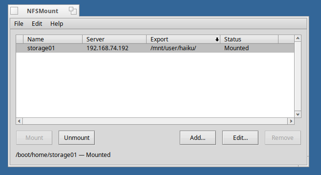
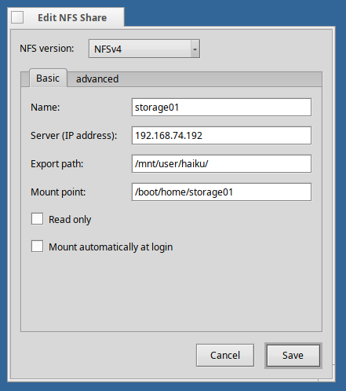

>[!WARNING]
>This is very early alpha code. 
>**Bug reports (please attach syslog and/or screenshots) and PRs welcome!**

>[!NOTE]
>An LLM was used to aid in development of this code.

# NFSMount

A native Haiku application for managing NFSv4 network shares. Mount, unmount,
save, and auto-mount NFS shares through a graphical interface instead of typing
terminal commands every session.

My test NFS server is  Unraid 6.12.13.

## Screenshots





## Features

- **Mount/Unmount** NFSv4 shares with one click
- **Save** share configurations persistently across reboots
- **Auto-mount** selected shares at login
- **Advanced options** for NFS4 tuning (timeout, retries, cache, port, etc.)
- **Live status** monitoring detects external mount/unmount changes
- Native Haiku UI using the Layout API and BColumnListView

## Documentation

- [Changelog](CHANGELOG.md) — version history and release notes.
- [Technical documentation](docs/DOCUMENTATION.md) — architecture, class
  reference, kernel API, settings format, build system.
- [TODO list](TODO.md) — pending features and deferred enhancements.

## Requirements

- Haiku R1/beta5 or later (NFSv4 kernel support required)
- NFS server with NFSv4 exports enabled
- Network connectivity between the Haiku machine and the NFS server

## Install (pre-built .hpkg)

The easiest way is to grab the .hpkg from the
[Releases](https://github.com/KevinAdams05/HaikuTools/releases) and double click it, and a Haiku Depot window should open and let you install the application.

## Build from source

### On a Haiku machine

NFSMount uses Haiku's standard makefile-engine. With the development tools
installed:

```sh
cd NFSMount/src
make
```

The binary lands in `objects.x86_64-cc13-release/NFSMount`. Copy it to
`/boot/home/config/non-packaged/apps/` (or anywhere on your `PATH`).

### Cross-build + .hpkg from a Linux Haiku build server

If you have a Haiku source tree built on Linux (cross-tools and built
artifacts under `~/haiku-build/haiku/generated.x86_64/`), the
`package/build-hpkg.sh` script produces a standalone `.hpkg` directly:

```sh
cd NFSMount
bash package/build-hpkg.sh
```

Output: `NFSMount/build/nfsmount-<version>-x86_64.hpkg`.

The `package/build.ps1` Windows wrapper handles the full pipeline (scp source
to build server, run the cross-build, scp the .hpkg back) for users with the
build server set up off-host.

## Usage

### Adding a share

1. Launch NFSMount
2. Click **Add...**
3. Fill in the share details:
   - **Name** — a friendly label (e.g. "NAS Music")
   - **Server** — IP or hostname of the NFS server
   - **Export path** — the path the server exports (e.g. `/mnt/user/Media` on
     UnRAID, `/volume1/Music` on Synology). Run `showmount -e <server>` from
     any Linux box to list available exports.
   - **Mount point** — local path on Haiku (e.g. `/boot/home/NAS/Music`)
4. Optionally check **Read only** or **Mount automatically at login**
5. Click **Save**

### Mounting / unmounting

Select a share in the list and click **Mount** or **Unmount**, or use the
keyboard shortcuts:

| Shortcut | Action |
|----------|--------|
| `Cmd+N`  | Add new share |
| `Cmd+E`  | Edit selected share |
| `Cmd+M`  | Mount selected |
| `Cmd+U`  | Unmount selected |
| `Delete` | Remove selected |
| `Cmd+W`  | Close window |
| `Cmd+Q`  | Quit |

### Auto-mount at login

Tick **Mount automatically at login** when adding or editing a share.
NFSMount installs a launch script at `~/config/settings/boot/launch/NFSMount`
that runs at login and mounts all auto-mount shares silently. If any
auto-mounts fail, the main window opens with error details.

### Advanced NFS4 options

Click **Edit...** on any share to access advanced settings:

| Option | Default | Description |
|--------|---------|-------------|
| Retry mode | Soft | Soft fails after retries; Hard retries forever |
| Timeout | 60 sec | Time before retransmission |
| Retries | 5 | Retry count (soft mode only) |
| Port | 2049 | NFS server port |
| Protocol | TCP | Transport protocol (TCP or UDP) |
| Dir cache | 5 sec | Directory cache revalidation interval |
| Metadata cache | On | Cache file metadata locally |
| Named attributes | Off | Emulate BFS-style named attributes |

## NFS server setup

The server must have NFSv4 exports enabled.

- **UnRAID** — Settings → NFS → Enable NFS, then enable NFSv4 (UnRAID 6.12+)
- **Synology** — Control Panel → File Services → NFS → Enable NFS service,
  select NFSv4
- **TrueNAS** — Sharing → Unix Shares (NFS), enable NFSv4 in the service config
- **Linux** — Add an export to `/etc/exports`:
  ```
  /srv/share  192.168.1.0/24(rw,sync,no_subtree_check)
  ```
  Then `exportfs -ra`.

## Settings

Share configurations are stored at `~/config/settings/NFSMount` as a flattened
`BMessage`. Safe to back up; portable between Haiku installs.

## Troubleshooting

**"Could not mount" error**
Check that the NFS server is reachable (`ping <server>`). Verify the export
path with `showmount -e <server>`. Check that NFS permissions on the server
allow your Haiku machine's IP.

**Mount succeeds but files are missing**
The export path is probably wrong. Most NAS devices include the volume in the
path (e.g. `/volume1/share` on Synology, `/mnt/user/share` on UnRAID), not just
`/share`.

**NFSv4 pseudo-root rebasing**
Some servers re-base exports below an `fsid=0` pseudo-root, in which case the
path you give Haiku is relative to that root, not the absolute server path.
If the server is reachable but mounts fail with "no such file or directory",
try the export path *without* the leading `/mnt/...` or `/volume...` prefix.

**Slow file access**
Increase the directory cache time, ensure metadata cache is enabled, or switch
to UDP for low-latency LANs.

**Check logs**
Haiku's NFS4 client writes diagnostics to `/var/log/syslog`.

## License

MIT License. Copyright 2026, Kevin Adams.
