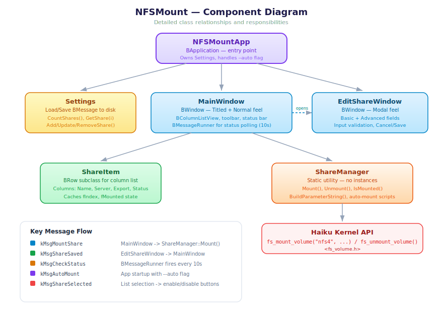
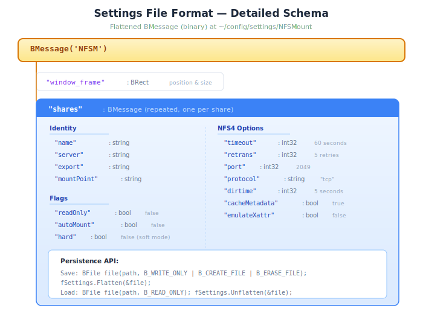

# NFSMount — Technical Documentation

## Architecture

NFSMount is a native Haiku C++ application built on the BeOS/Haiku API. It
uses the kernel's `fs_mount_volume()` API to mount NFS shares directly,
without shelling out to command-line tools. Both filesystems Haiku ships
in-tree are supported:

- **`nfs4`** — NFSv4 (the default for new shares).
- **`nfs`** — the legacy BeOS-era NFSv2 client, used as a compatibility
  fallback for servers that don't speak v4.

Each share carries an `nfsVersion` field that selects between the two; the
two protocols use different mount-parameter formats and slightly different
sets of options, which is why the editor exposes a separate "NFSv2" tab
(see `EditShareWindow` below).

### Component Diagram



### Class Reference

#### NFSMountApp (App.h / App.cpp)

Entry point. Subclasses `BApplication`.

| Method | Purpose |
|--------|---------|
| `ReadyToRun()` | Opens MainWindow (normal mode) or calls `_AutoMount()` |
| `ArgvReceived()` | Parses `--auto` flag for auto-mount mode |
| `AboutRequested()` | Calls `show_about_window()`. Lets the Deskbar's standard "About this app" entry work without going through the menu. |
| `QuitRequested()` | Returns `true` (default behavior) |
| `_AutoMount()` | Mounts all auto-mount shares; shows errors or quits |

**Auto-mount mode**: When launched with `--auto`, the app mounts all shares
that have the auto-mount flag set, then exits. If any mount fails, it shows
an alert offering to open the main window. This mode is triggered by the
login launch script.

#### Settings (Settings.h / Settings.cpp)

Manages persistent share configurations.

| Method | Purpose |
|--------|---------|
| `Load()` / `Save()` | Read/write BMessage from/to disk |
| `CountShares()` | Number of saved shares |
| `GetShare(index)` | Retrieve a share's BMessage by index |
| `AddShare()` / `UpdateShare()` / `RemoveShare()` | CRUD operations |
| `WindowFrame()` / `SetWindowFrame()` | Persist window geometry |
| `HasAutoMountShares()` | Whether any share has auto-mount enabled |

**File format**: A single flattened `BMessage` with what code `'NFSM'`. The
message contains:
- `"window_frame"` (BRect) — main window position and size
- `"shares"` (BMessage, repeated) — one nested message per share

Each share message contains string, bool, and int32 fields for all
configuration options. See `Constants.h` for field name constants.

#### ShareManager (ShareManager.h / ShareManager.cpp)

Static utility class for NFS operations. No instances are created.

| Method | Purpose |
|--------|---------|
| `Mount(share)` | Build params, create mount point, call `fs_mount_volume()` |
| `Unmount(path)` | Call `fs_unmount_volume()` |
| `IsMounted(path)` | Compare device IDs of path vs. parent to detect mount |
| `BuildParameterString(share)` | Convert BMessage fields to NFS4 param string |
| `CreateMountPoint(path)` | `create_directory()` with parents |
| `InstallAutoMount()` | Write launch script to boot/launch/ |
| `RemoveAutoMount()` | Delete the launch script |

**Mount detection**: `IsMounted()` works by comparing the `st_dev` field
from `stat()` on the mount point and its parent directory. If they differ,
a separate filesystem is mounted at that path.

**Parameter string format**: The NFS4 kernel add-on
(`src/add-ons/kernel/file_systems/nfs4/kernel_interface.cpp`) parses mount
parameters as:
```
<ip_address>:<export_path> [option] [option] ...
```

Available options: `hard`, `soft`, `timeo=N`, `retrans=N`, `ac`, `noac`,
`xattr-emu`, `noxattr-emu`, `port=N`, `proto=X`, `dirtime=N`.

`BuildParameterString()` only emits non-default options to keep the string
minimal.

#### MainWindow (MainWindow.h / MainWindow.cpp)

Primary UI. Subclasses `BWindow` with Titled look and Normal feel.
Resizable; size limits derived from the layout via
`B_AUTO_UPDATE_SIZE_LIMITS`. Window-frame restored from settings on
launch and saved back on quit.

**Layout**: Uses `BLayoutBuilder::Group<>` for vertical arrangement:

1. **`BMenuBar`** at the top with three menus:
   - **File** — Import shares… (`Cmd-O`), Export shares… (`Cmd-S`),
     Quit (`Cmd-Q`)
   - **Edit** — Add… (`Cmd-N`), Edit… (`Cmd-E`), Remove (`Delete`),
     Mount (`Cmd-M`), Unmount (`Cmd-U`)
   - **Help** — About NFSMount…
2. Below the menu bar, a nested vertical group (with window insets):
   - `BColumnListView` (weighted 10x for expansion)
   - Horizontal button group with Mount/Unmount on the left,
     Add/Edit/Remove on the right
   - `BStringView` status bar at the bottom — explicit
     `B_SIZE_UNLIMITED` max width so it doesn't cap the column's
     resizable range (default `BStringView::MaxSize()` returns the
     preferred text-fit width).

**Menu/button enable state**: `_UpdateButtons()` and
`_UpdateMenuItems()` are called whenever the selection changes or
shares are added/removed. Mount is enabled only on an unmounted
selection; Unmount only on a mounted one; Edit/Remove require a
selection (Remove additionally requires the share to be unmounted).
Export is disabled when there are zero shares.

**Mount status monitoring**: A `BMessageRunner` fires `kMsgCheckStatus`
every 10 seconds. The handler iterates all `ShareItem` rows and compares
cached status with live `IsMounted()` results. Changed rows are updated
and invalidated for redraw.

**Window lifecycle**: On quit, saves window frame to settings and updates
the auto-mount launch script (installs if any share has auto-mount,
removes if none do). Owns an `ImportExport` instance that's torn down in
the destructor.

**Message handling**:

| Message | Handler |
|---------|---------|
| `kMsgShareSelected` | Update button + menu enable/disable states |
| `kMsgShareInvoked` | Open edit window (double-click) |
| `kMsgMountShare` | Mount the selected share |
| `kMsgUnmountShare` | Unmount the selected share |
| `kMsgAddShare` | Open blank EditShareWindow |
| `kMsgEditShare` | Open EditShareWindow with share data |
| `kMsgRemoveShare` | Confirm and remove share from settings |
| `kMsgShareSaved` | Handle save from EditShareWindow |
| `kMsgCheckStatus` | Periodic mount status refresh |
| `kMsgImportShares` | Show the open `BFilePanel` (delegates to `ImportExport`) |
| `kMsgExportShares` | Show the save `BFilePanel` (delegates to `ImportExport`) |
| `kMsgImportPanelDone` | Read selected file via `ImportExport::ImportFrom()`, refresh list, surface result/skip count |
| `kMsgExportPanelDone` | Write selected file via `ImportExport::ExportTo()`, surface success/error |
| `kMsgShowAbout` | Calls `show_about_window()` |

#### EditShareWindow (EditShareWindow.h / EditShareWindow.cpp)

Add/edit dialog. Title changes based on context ("Add NFS Share" vs
"Edit NFS Share"). `B_TITLED_WINDOW` (not modal) since 0.0.4 — the
user can keep the main window in view while editing. Closes on
Escape via `B_CLOSE_ON_ESCAPE`. Resizable; size limits derived from
the layout.

**Layout**: Vertical group containing:

1. **NFS version selector** (`BMenuField`, "NFSv2 (compatible)" /
   "NFSv4") at the top, outside the tab view because changing it
   alters the tab set.
2. **`BTabView`** with up to three tabs:
   - **Basic** — always present. Grid of labeled text controls
     (name, server, export, mount point) plus the read-only and
     auto-mount checkboxes.
   - **Advanced** — present only when NFSv4 is selected. Soft/hard
     radio pair, timeout, retries, port, protocol (TCP/UDP),
     directory cache, metadata-cache toggle, named-attribute
     emulation.
   - **NFSv2** — present only when NFSv2 is selected. Hostname, UID,
     GID.
3. Cancel/Save button row at the bottom.

`_UpdateVersionUI()` swaps the third tab in/out by calling
`BTabView::RemoveTab` and `AddTab` against pre-built `BTab`/`BView`
pairs. `BTab::SetView` is a no-op when the view is unchanged, so
the user's typed values survive a version flip.

**Width-resize fix**: The four checkboxes (`fReadOnlyBox`,
`fAutoMountBox`, `fCacheMetadataBox`, `fEmulateXattrBox`) explicitly
set `B_SIZE_UNLIMITED` max width. `BCheckBox::MaxSize()` defaults to
the preferred (text-fit) width, which in a vertical layout caps the
column's max width and locks horizontal resize.

**Validation**: `_ValidateFields()` checks:
- Name is non-empty
- Server is non-empty
- Export path starts with `/`
- Mount point starts with `/`
- For NFSv2 only: hostname is non-empty

Validation failure shows a `BAlert` and focuses the offending field.

**Communication**: On save, posts a `kMsgShareSaved` message to the target
window (MainWindow) containing the share BMessage and the edit index (-1
for new shares).

#### ShareItem (ShareItem.h / ShareItem.cpp)

`BRow` subclass for `BColumnListView`. Each instance represents one saved
NFS share.

**Columns**:

| Index | Column | Content |
|-------|--------|---------|
| 0 | Name | Friendly share name |
| 1 | Server | NFS server address |
| 2 | Export | Export path on server |
| 3 | Status | "Mounted" or "Unmounted" |

**State**: Stores the share's settings index (`fIndex`) for mapping back to
`Settings`. Caches mount status (`fMounted`) to avoid redundant stat calls.

#### ImportExport (ImportExport.h / ImportExport.cpp)

Wraps a pair of `BFilePanel` instances (one open, one save) for
the File menu's Import / Export commands. Keeps the file-panel
plumbing out of `MainWindow`.

| Method | Purpose |
|--------|---------|
| `ShowOpenPanel()` | Display the open panel; selection posts `kMsgImportPanelDone` to the target |
| `ShowSavePanel()` | Display the save panel; submission posts `kMsgExportPanelDone` |
| `ExportTo(dirRef, name, settings)` | Write the share list to `<dir>/<name>` (appends `.nfsmount` if missing) |
| `ImportFrom(ref, settings, &imported, &skipped)` | Validate header, append non-duplicate shares to `Settings` |

**On-disk format** (flattened `BMessage`, what code is irrelevant —
the magic int field is the real signature):

| Field | Type | Value |
|-------|------|-------|
| `"magic"` | int32 | `'NFSE'` |
| `"version"` | int32 | `kExportVersion` (currently `1`) |
| `"shares"` | BMessage[] | one entry per share, identical schema to the in-memory `Settings` shares |

Window-frame and other UI state are intentionally *not* exported.

**Compatibility rules**:
- Files with the wrong magic are rejected with `B_BAD_TYPE`.
- Files written by a *newer* version (`version > kExportVersion`)
  are rejected with `B_NOT_SUPPORTED`, so unknown fields are never
  silently dropped.
- Older files are accepted; missing optional fields fall back to
  defaults via the same `FindXxx`/default-value pattern that
  `Settings::GetShare()` consumers already use.

**Duplicate handling**: Imported shares whose `name` matches an
existing share are skipped rather than producing ambiguous
duplicates. The skipped count is returned to the caller and surfaced
in the status bar (e.g. *"Imported 3 share(s); 1 skipped (already
exist by name)"*).

#### AboutBox (AboutBox.h / AboutBox.cpp)

A single free function — `void show_about_window()` — that builds
and displays Haiku's standard `BAboutWindow`. The window owns
itself and quits when closed, so the caller doesn't need to retain
a pointer.

| Section | Content |
|---------|---------|
| Description | Two-paragraph overview of what NFSMount does |
| Copyright | Set via `BAboutWindow::AddCopyright(2026, "Kevin Adams")`. When the first year equals the current year, the dialog renders just `© 2026 Kevin Adams`. |
| Source code | Link to the repo on GitHub |
| License | Full MIT license text, embedded as a string constant kept in sync with the project's `LICENSE` file |
| Acknowledgements | Notes which Haiku kits the app is built on (be, tracker, columnlistview, localestub) and the GCC runtime. None require attribution; listing is a courtesy. |

Called from two places:
- `MainWindow::MessageReceived` on `kMsgShowAbout` (the Help menu).
- `NFSMountApp::AboutRequested` (the Deskbar's standard "About this
  app" action sends `B_ABOUT_REQUESTED` to the application).

#### Constants (Constants.h)

Defines all shared constants:
- Application signature and name
- NFS filesystem identifiers (`kNFSFileSystem`, `kNFS4FileSystem`)
- NFS version selectors and default values (timeout, retrans, port,
  protocol, dirtime, default UID/GID for v2)
- BMessage `what` codes for inter-window messaging — including the
  Import/Export pair, the file-panel callbacks, and `kMsgShowAbout`
- Settings field name strings (including v2 fields: `nfsVersion`,
  `hostname`, `uid`, `gid`)
- Export-file format constants: `kExportMagic` (`'NFSE'`),
  `kExportVersion`, `kExportFieldMagic`, `kExportFieldVersion`,
  `kExportFieldShares`, `kExportFileExtension` (`.nfsmount`),
  `kExportMimeType`
- Status check interval
- Auto-mount launch script name

---

## Kernel API Reference

### fs_mount_volume()

```c
#include <fs_volume.h>

dev_t fs_mount_volume(
    const char* where,        // Local mount point path
    const char* device,       // NULL for network filesystems
    const char* filesystem,   // "nfs4"
    uint32 flags,             // 0 or B_MOUNT_READ_ONLY
    const char* parameters    // NFS4 parameter string
);
```

Returns a positive device ID on success, or a negative `status_t` error code.

### fs_unmount_volume()

```c
status_t fs_unmount_volume(
    const char* path,         // Mount point to unmount
    uint32 flags              // 0 or B_FORCE_UNMOUNT
);
```

Returns `B_OK` on success.

### Key Header Files

| Header | Contents |
|--------|----------|
| `<fs_volume.h>` | `fs_mount_volume()`, `fs_unmount_volume()` |
| `<FindDirectory.h>` | `find_directory()`, `B_USER_SETTINGS_DIRECTORY` |
| `<Directory.h>` | `create_directory()` |
| `<ColumnListView.h>` | `BColumnListView`, `BRow` (private/interface) |
| `<ColumnTypes.h>` | `BStringColumn`, `BStringField` (private/interface) |

---

## Settings File Format

**Path**: `~/config/settings/NFSMount`

**Format**: Flattened `BMessage` (binary). Can be inspected with Haiku's
`listattr` or by writing a small tool that unflattens and prints it.

**Schema**:



---

## Auto-Mount Mechanism

When any share has the "Mount automatically at login" flag set, NFSMount
installs a shell script at:

```
~/config/settings/boot/launch/NFSMount
```

This directory is scanned by Haiku at login. The script contains:

```bash
#!/bin/sh
"/path/to/NFSMount" --auto
```

The path is determined at runtime via `be_app->GetAppInfo()`.

**Startup flow with --auto**:

1. `ArgvReceived()` sets `fAutoMode = true`
2. `ReadyToRun()` calls `_AutoMount()` instead of opening the window
3. `_AutoMount()` iterates all shares, mounting those with `autoMount = true`
4. If all succeed: quit silently
5. If any fail: show an alert with the error list, offering to open the
   main window or dismiss

The launch script is automatically removed when no shares have auto-mount
enabled (checked on every settings save and window close).

---

## Build System

NFSMount uses Haiku's `makefile-engine`, the standard build system for
third-party Haiku applications.

**Dependencies**:
- `libbe.so` — Core Haiku API: `BApplication`, `BWindow`, `BMessage`,
  `BMenuBar`, `BTabView`, `BAboutWindow`, layout API, etc.
- `libtracker.so` — Hosts `BFilePanel` (used by `ImportExport`) and
  `BColumnListView`/`BColumnTypes` (Tracker's column-list widget).
- `libcolumnlistview.a` — Static archive linked into the binary
  alongside libtracker for the column-list widget. (Cross-build:
  `$HAIKU_DEVEL_LIB/libcolumnlistview.a`.)
- `liblocalestub.a` — Locale Kit stub (for future localization).
- `libroot.so` + `libstdc++` + `libgcc_s` — standard runtime.

**Private headers**: `BColumnListView` and `BColumnTypes` are in Haiku's
private interface headers at
`/boot/system/develop/headers/private/interface/`.

**Build commands**:

```bash
# Debug build
make

# Release build (optimized)
make OPT_LEVEL=FULL

# Clean
make clean
```

---

## Future Work

Pending and deferred items are tracked in [`TODO.md`](../TODO.md) at the
project root.

---

## References

- [Haiku API Documentation](https://www.haiku-os.org/docs/api/)
- [Haiku Human Interface Guidelines](https://www.haiku-os.org/docs/HIG/index.xml)
- [Haiku Coding Guidelines](https://www.haiku-os.org/development/coding-guidelines)
- [NFSv4 Client Blog Post](https://www.haiku-os.org/blog/pawe%C5%82_dziepak/2013-03-15_nfsv4_client_finally_merged/)
- [Haiku makefile-engine](https://www.haiku-os.org/documents/dev/makefile-engine)
- NFS4 kernel add-on source: `src/add-ons/kernel/file_systems/nfs4/`
- fs_mount_volume() header: `headers/os/kernel/fs_volume.h`
