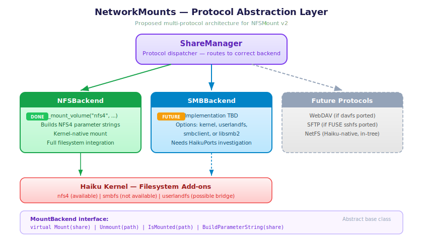
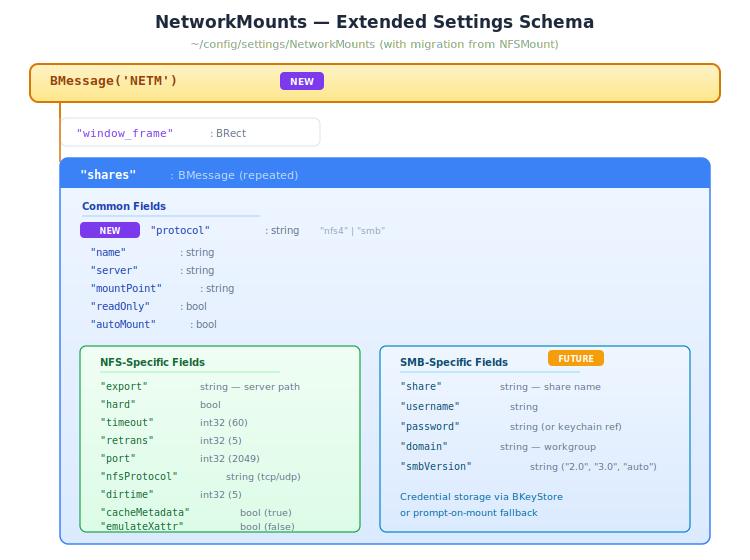
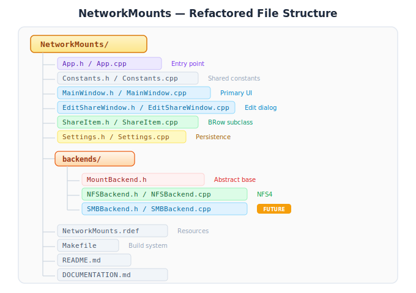

# NetworkMounts — Multi-Protocol Network Share Manager for Haiku

## Project Vision

Rename and expand NFSMount into **NetworkMounts**, a unified GUI for managing
network shares across multiple protocols. NFS works today; SMB support is added
when a viable client becomes available.

---

## 1. Current State (NFSMount v1)

- NFSv4 only, via `fs_mount_volume("nfs4", ...)`
- Kernel-native mount — shares appear as real filesystem entries
- Full GUI: add/edit/remove/mount/unmount, persistent settings, auto-mount
- All NFS4 options exposed (timeout, retries, hard/soft, port, protocol, etc.)

---

## 2. Proposed Architecture

### Protocol Abstraction Layer

Replace the current `ShareManager` static class with a protocol-based
dispatch system:



### UI Changes

**EditShareWindow:**
- Add "Protocol" dropdown at the top (NFS4 / SMB)
- Protocol selection shows/hides protocol-specific options
- NFS tab: current advanced options (timeout, retries, hard/soft, etc.)
- SMB tab: username, password/keychain, domain/workgroup, SMB version

**MainWindow:**
- Add "Protocol" column to the share list
- Status column reflects protocol-specific states
- Filter/group by protocol (optional)

**App rename:**
- Binary: NFSMount → NetworkMounts
- Signature: application/x-vnd.NFSMount → application/x-vnd.NetworkMounts
- Settings file: ~/config/settings/NFSMount → ~/config/settings/NetworkMounts
  (with migration from old file if present)

### Settings Schema (Extended)



---

## 3. SMB Support Analysis

### Option A: Kernel-Level SMB (cifsmount / fs_mount_volume)

**Status**: Does not exist in Haiku.

No SMB/CIFS kernel filesystem add-on exists in the Haiku source tree. Building
one would be a major undertaking — essentially porting or writing an SMB2/3
client as a kernel add-on.

**Effort**: Very high (months of work, kernel-level C/C++)
**Result**: Best possible integration — real mount, Tracker browsing, full POSIX
**Feasibility**: Not practical for this project alone

### Option B: userlandfs + FUSE SMB Client

**Status**: Needs investigation.

Haiku has a `userlandfs` framework (`src/add-ons/kernel/file_systems/userlandfs/`)
that allows userspace filesystem implementations. If a FUSE-compatible SMB
client (like `smbnetfs` or `fusesmb`) has been ported to Haiku, it could be
used through userlandfs.

**Investigation needed:**
- Check HaikuPorts for `smbnetfs`, `fusesmb`, `libsmb2`, or `samba` packages
- Check if userlandfs FUSE compatibility layer works with modern FUSE clients
- Check if libsmb2 (lightweight SMB2/3 client library) is available — could
  build a custom userlandfs module around it

**Effort**: Medium (weeks, if a working FUSE SMB client exists)
**Result**: Real mount point, Tracker browsing, mostly-POSIX semantics
**Feasibility**: Depends entirely on what's available on HaikuPorts

### Option C: smbclient Command-Line Tool

**Status**: Needs investigation.

If Samba's `smbclient` is packaged on HaikuPorts, we could shell out to it
for file operations. This would NOT provide a mount — instead it would work
as a file transfer/browser mode within the app.

**Investigation needed:**
- Check HaikuPorts for `samba` or `smbclient` packages
- Test if smbclient runs correctly on Haiku
- Determine if `libsmbclient` (C library) is available for direct integration
  without shelling out

**Effort**: Low-medium (days-weeks)
**Result**: File transfer only, no mount, no Tracker integration
**Feasibility**: Likely possible if samba is packaged

### Option D: libsmb2 Integration

**Status**: Most promising for a lightweight solution.

libsmb2 (https://github.com/sahlberg/libsmb2) is a small, portable C library
that implements SMB2/3 client operations. It has no dependencies beyond libc
and could potentially be built for Haiku.

**Two integration paths:**
1. **As a userlandfs module**: Register as a filesystem, provide real mount
2. **As an in-app library**: Build a file browser/transfer UI within
   NetworkMounts itself (no Tracker integration)

**Investigation needed:**
- Try building libsmb2 for Haiku (cross-compile or on Haiku)
- Check if HaikuPorts already has a recipe
- Evaluate API completeness for file browsing, read, write, directory listing

**Effort**: Medium (weeks)
**Result**: Could range from file transfer to full mount depending on approach
**Feasibility**: Good — libsmb2 is designed for portability

### Option E: NetFS (Haiku-to-Haiku)

**Status**: Already exists in Haiku source tree.

NetFS is Haiku's native network filesystem. It only works between Haiku
machines, so it's not useful for UnRAID/Windows/Linux shares. But it could
be included as a third protocol option for Haiku-to-Haiku networking.

**Effort**: Low (NetFS is built, just needs UI integration)
**Result**: Full mount, but Haiku-to-Haiku only
**Feasibility**: Easy, but limited use case

---

## 4. Recommended Approach

### Phase 1: Ship NFSMount as-is (DONE)
NFS4 support is complete and working. Ship it, test it, get user feedback.

### Phase 2: Refactor to protocol abstraction
- Rename to NetworkMounts
- Extract NFSBackend from ShareManager
- Add protocol field to settings and UI
- Keep SMB backend as a stub with "SMB support coming soon" message

### Phase 3: Investigate SMB options
- Search HaikuPorts for samba, smbclient, libsmb2, fusesmb
- Try building libsmb2 for Haiku
- Determine best viable path (Option B, C, or D above)

### Phase 4: Implement SMB backend
- Build the chosen SMB solution
- Integrate into NetworkMounts as SMBBackend
- Add SMB-specific UI fields (username, password, domain)
- Handle credential storage (Haiku keystore API or encrypted settings)

### Phase 5: Additional protocols (optional)
- WebDAV (if Haiku gets a davfs)
- SFTP (if FUSE sshfs is ported)
- NetFS (Haiku-native, already in the OS)

---

## 5. Credential Management Considerations

SMB shares typically require authentication. Options for storing credentials:

1. **In settings file (plaintext)** — Simple but insecure. Acceptable for
   local single-user systems if file permissions are restrictive.

2. **Haiku Keystore API** — Haiku has a keystore service
   (`src/servers/keystore/`). Uses `BKeyStore` class from the Support Kit.
   This is the proper Haiku way to store credentials.

3. **Prompt every time** — Don't store passwords at all. Ask on each mount.
   Safe but annoying for auto-mount.

4. **Keychain file** — Separate encrypted file, unlocked with a master
   password. More complex but portable.

**Recommendation**: Use `BKeyStore` for Haiku-native credential storage.
Fall back to prompting if keystore is unavailable.

---

## 6. Server Discovery (Future Feature)

Both NFS and SMB support service discovery:

- **NFS**: No standard discovery (must know server IP and export path)
- **SMB**: NetBIOS browsing, mDNS/Bonjour (`_smb._tcp`), WS-Discovery
- **General**: mDNS/DNS-SD can discover NFS exports too if the server
  advertises them

A "Browse Network" feature could scan the local network for available
shares. This would require:
- mDNS client (Haiku has `dns_sd` support via BonjourAPI or avahi)
- NetBIOS name resolution for SMB
- UI for browsing discovered servers and their exports

This is a nice-to-have feature for Phase 5+.

---

## 7. File Structure (After Refactor)



### MountBackend Interface

```cpp
class MountBackend {
public:
    virtual ~MountBackend() {}

    virtual status_t    Mount(const BMessage* share) = 0;
    virtual status_t    Unmount(const char* mountPoint) = 0;
    virtual bool        IsMounted(const char* mountPoint) = 0;
    virtual BString     BuildParameterString(
                            const BMessage* share) = 0;

    static MountBackend* BackendForProtocol(const char* protocol);
};
```

---

## 8. Open Questions

- Is libsmb2 or samba available on HaikuPorts today?
- Does Haiku's userlandfs FUSE layer work with modern FUSE3 clients?
- Is BKeyStore stable and documented enough for credential storage?
- Should the app support SMB1 at all (security concerns) or only SMB2/3?
- What's the right UX for credential prompting on auto-mount?
- Should we support mounting SMB shares from the command line too
  (a `mount_smb` equivalent)?
