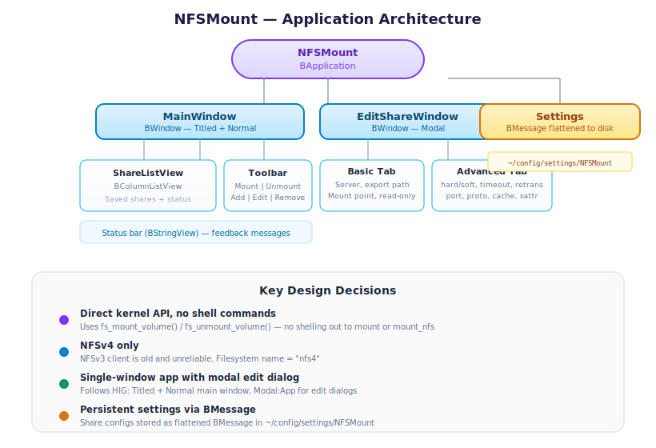
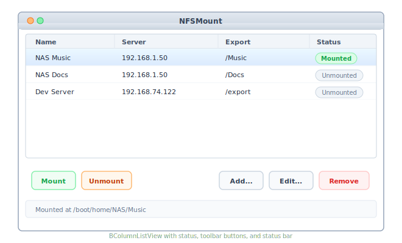
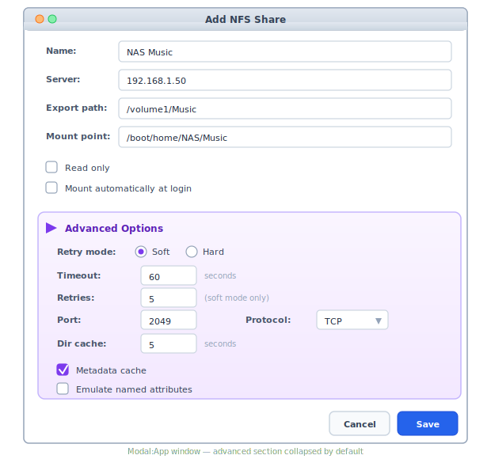
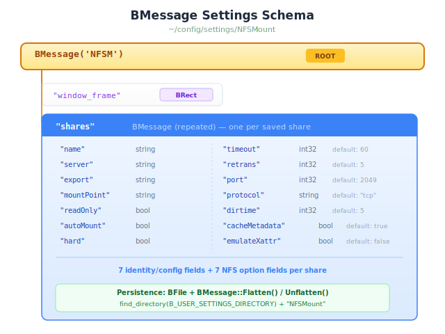
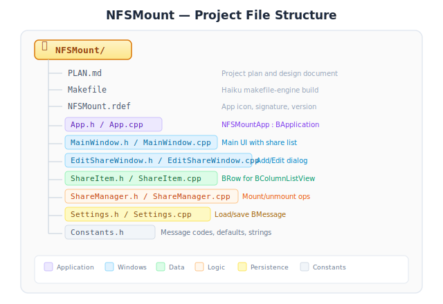

# NFSMount — Haiku NFS Share Manager

A native Haiku GUI application for mounting, managing, and auto-mounting NFSv4
network shares. Written in C++ using the BeOS/Haiku API, following Haiku coding
guidelines and Human Interface Guidelines.

---

## 1. Problem Statement

Haiku has kernel-level NFSv4 support but no GUI for managing NFS mounts. Users
must manually type mount commands in Terminal every session. There is no way to
save, organize, or auto-mount shares without writing custom scripts.

This tool fills that gap with a native Haiku application that:
- Provides a graphical interface for mounting/unmounting NFS shares
- Saves share configurations persistently
- Optionally auto-mounts shares at login
- Exposes advanced NFS4 mount options through an intuitive UI

---

## 2. Architecture Overview



---

## 3. Mount API Integration

### Mounting

```cpp
#include <fs_volume.h>

// Build NFS4 parameter string: "server:path [options]"
BString params;
params << serverAddress << ":" << exportPath;
if (hard)
    params << " hard";
if (timeout != 60)
    params << " timeo=" << timeout;
if (retrans != 5)
    params << " retrans=" << retrans;
// ... etc.

// Create mount point directory if needed
create_directory(mountPoint, 0755);

// Mount
dev_t device = fs_mount_volume(
    mountPoint,         // local path
    NULL,               // no device for network FS
    "nfs4",             // filesystem add-on name
    readOnly ? B_MOUNT_READ_ONLY : 0,
    params.String()     // NFS4 parameter string
);

if (device < 0)
    // error: strerror(device)
```

### Unmounting

```cpp
status_t result = fs_unmount_volume(mountPoint, 0);
// flags: B_FORCE_UNMOUNT available if needed
```

### NFS4 Parameter String Format

As parsed by the NFS4 kernel add-on (`kernel_interface.cpp`):

```
<ipv4_or_ipv6>:<server_path> [option] [option] ...
```

| Option        | Default | Description                                    |
|---------------|---------|------------------------------------------------|
| `hard`        | off     | Retry requests until success                   |
| `soft`        | on      | Retry up to retrans times, then fail           |
| `timeo=N`     | 60      | Request timeout in seconds                     |
| `retrans=N`   | 5       | Number of retries (soft mode only)             |
| `ac`          | on      | Use metadata cache                             |
| `noac`        | off     | Disable metadata cache                         |
| `xattr-emu`   | off     | Emulate named attributes                       |
| `noxattr-emu` | on      | Do not emulate named attributes                |
| `port=N`      | 2049    | Server port                                    |
| `proto=X`     | tcp     | Transport protocol                             |
| `dirtime=N`   | 5       | Directory cache revalidation interval (seconds)|

---

## 4. UI Design

### 4a. Main Window



- **BColumnListView** with columns: Name, Server, Export Path, Status
- Status column shows "Mounted" (green) or "Unmounted" (gray)
- Buttons enable/disable based on selection and mount state
- Double-click a share opens the Edit window
- Status bar at bottom shows details of selected share
- Window position and size saved/restored across sessions

### 4b. Edit Share Window



- Opens as Modal:App so user completes editing before returning
- "Advanced Options" section collapsed by default (BBox or disclosure triangle)
- Input validation: server address required, export path must start with `/`,
  mount point must be under `/boot/home/`
- "Save" validates and closes; "Cancel" discards changes
- Title is "Add NFS Share" or "Edit NFS Share" depending on context

### 4c. Keyboard Shortcuts

| Shortcut    | Action              |
|-------------|---------------------|
| Cmd+N       | Add new share       |
| Cmd+E       | Edit selected share |
| Cmd+M       | Mount selected      |
| Cmd+U       | Unmount selected    |
| Delete      | Remove selected     |
| Cmd+Q       | Quit                |
| Cmd+W       | Close window        |

---

## 5. Settings Persistence

Settings file: `~/config/settings/NFSMount` (found via `find_directory()`)

### BMessage Schema



### Load/Save

```cpp
// Save
BPath path;
find_directory(B_USER_SETTINGS_DIRECTORY, &path);
path.Append("NFSMount");
BFile file(path.Path(), B_WRITE_ONLY | B_CREATE_FILE | B_ERASE_FILE);
fSettings.Flatten(&file);

// Load
BFile file(path.Path(), B_READ_ONLY);
fSettings.Unflatten(&file);
```

---

## 6. Auto-Mount at Login

Haiku supports launch scripts via `~/config/settings/boot/launch/`. A symlink
or script placed here runs at login.

**Approach:** NFSMount registers itself as a launch item when any share has
"auto-mount" enabled. On startup, if launched with a `--auto` argument, it
mounts all auto-mount shares silently (no window) and exits. If any fail, it
opens the main window with error status displayed.

Alternatively, the app can install a script at:
```
~/config/settings/boot/launch/NFSMount
```

That runs:
```bash
/boot/system/apps/NFSMount --auto
```

---

## 7. File Structure



### Class Responsibilities

| Class              | Role                                                      |
|--------------------|-----------------------------------------------------------|
| `NFSMountApp`      | BApplication subclass. Entry point, settings owner,       |
|                    | handles `--auto` flag, creates MainWindow.                |
| `MainWindow`       | Main UI. Owns the share list, toolbar, status bar.        |
|                    | Dispatches mount/unmount to ShareManager.                 |
| `EditShareWindow`  | Modal dialog for add/edit. Validates input, returns       |
|                    | share config as BMessage to MainWindow.                   |
| `ShareItem`        | BRow subclass representing one share in the list view.    |
|                    | Displays name, server, export, status columns.            |
| `ShareManager`     | Non-UI class. Builds NFS4 parameter strings, calls        |
|                    | `fs_mount_volume()` / `fs_unmount_volume()`, checks       |
|                    | mount status, creates mount point directories.            |
| `Settings`         | Loads/saves the settings BMessage. Provides accessors     |
|                    | for the share list and window frame.                      |

---

## 8. Message Codes

```cpp
enum {
    kMsgShareSelected       = 'shsl',   // Share list selection changed
    kMsgMountShare          = 'mnts',   // Mount button clicked
    kMsgUnmountShare        = 'umnt',   // Unmount button clicked
    kMsgAddShare            = 'adds',   // Add button clicked
    kMsgEditShare           = 'edts',   // Edit button / double-click
    kMsgRemoveShare         = 'rmvs',   // Remove button clicked
    kMsgShareSaved          = 'svds',   // EditShareWindow completed save
    kMsgShareCancelled      = 'cncl',   // EditShareWindow cancelled
    kMsgAutoMount           = 'auto',   // Auto-mount on startup
};
```

---

## 9. Implementation Order

### Phase 1 — Core (MVP)
1. **Settings** — Load/save BMessage to disk
2. **ShareManager** — Mount, unmount, check status, build parameter strings
3. **NFSMountApp** — BApplication skeleton, settings init
4. **MainWindow** — Share list with Mount/Unmount/Add/Remove buttons
5. **EditShareWindow** — Basic fields only (name, server, export, mount point,
   read-only checkbox)
6. **ShareItem** — BRow with columns for the list view

Goal: a working app that can add shares, mount them, unmount them, and
remember them across sessions.

### Phase 2 — Polish
7. **Advanced options** in EditShareWindow (timeout, retrans, hard/soft, etc.)
8. **Auto-mount** support (--auto flag, launch script install/remove)
9. **Mount status monitoring** — periodic check or node monitoring to detect
   external unmounts
10. **Error reporting** — clear error dialogs when mount fails, with
    suggestions (check server IP, check NFS export, check syslog)

### Phase 3 — Nice to Have
11. **App icon** (HVIF format) and `.rdef` resources
12. **About window** with version info
13. **Localization** via Locale Kit / .catkeys
14. **Drag & drop** — drag a share to Tracker to open the mount point
15. **Deskbar replicant** — small shelf icon showing mount status

---

## 10. Build System

Use a **Makefile** based on Haiku's `makefile-engine` (standard for third-party
Haiku apps):

```makefile
NAME = NFSMount
TYPE = APP
SRCS = App.cpp MainWindow.cpp EditShareWindow.cpp ShareItem.cpp \
       ShareManager.cpp Settings.cpp
RDEFS = NFSMount.rdef
LIBS = be tracker columnlistview
SYSTEM_INCLUDE_PATHS = /boot/system/develop/headers
include $(BUILDHOME)/etc/makefile-engine
```

This compiles natively on Haiku. For cross-compilation from the Haiku source
tree, a Jamfile can be added later.

---

## 11. Testing Plan

| Test                           | Method                                   |
|--------------------------------|------------------------------------------|
| Mount a real NFS share         | UnRAID NFS export to Haiku hardware      |
| Unmount cleanly                | Unmount via GUI, verify directory empty   |
| Mount with bad server IP       | Verify error dialog, no crash             |
| Mount with bad export path     | Verify error dialog                       |
| Save/load settings             | Add shares, quit, relaunch, verify list   |
| Auto-mount on login            | Enable, reboot, verify shares mounted     |
| Window position persistence    | Move/resize, quit, relaunch, verify       |
| Read-only mount                | Mount RO, attempt write, verify denied    |
| Advanced options               | Mount with non-default timeout, verify    |
| Double-click to edit           | Verify edit window opens with share data  |
| Remove share while mounted     | Should prompt to unmount first            |
| Multiple shares same server    | Mount two exports from same NFS server    |

---

## 12. References

| Resource | URL / Path |
|----------|------------|
| Haiku API docs | https://www.haiku-os.org/docs/api/ |
| Haiku HIG | https://www.haiku-os.org/docs/HIG/index.xml |
| Haiku coding guidelines | https://www.haiku-os.org/development/coding-guidelines |
| fs_mount_volume() header | `headers/os/kernel/fs_volume.h` |
| NFS4 mount parameters | `src/add-ons/kernel/file_systems/nfs4/kernel_interface.cpp` |
| NFS4 config struct | `src/add-ons/kernel/file_systems/nfs4/FileSystem.h` |
| makefile-engine docs | https://www.haiku-os.org/documents/dev/makefile-engine |
| BColumnListView | `headers/private/interface/ColumnListView.h` |
